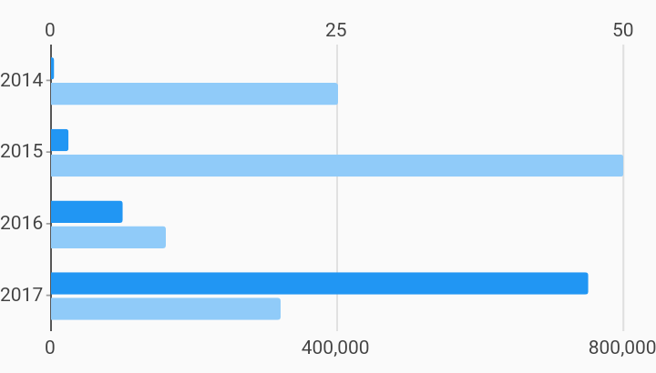

# Horizontal Bar Secondary Axis Axes Example



Example:

```
/// Bar chart example
import 'package:flutter/material.dart';
import 'package:charts_flutter_clone/flutter.dart' as charts;

/// Example of using a primary and secondary axis (left & right respectively)
/// for a set of grouped bars. This is useful for comparing Series that have
/// different units (revenue vs clicks by region), or different magnitudes (2017
/// revenue vs 1/1/2017 revenue by region).
///
/// The first series plots using the primary axis to position its measure
/// values (bar height). This is the default axis used if the measureAxisId is
/// not set.
///
/// The second series plots using the secondary axis due to the measureAxisId of
/// secondaryMeasureAxisId.
///
/// Note: primary and secondary may flip left and right positioning when
/// RTL.flipAxisLocations is set.
class HorizontalBarChartWithSecondaryAxis extends StatelessWidget {
  static const secondaryMeasureAxisId = 'secondaryMeasureAxisId';
  final List<charts.Series> seriesList;
  final bool animate;

  HorizontalBarChartWithSecondaryAxis(this.seriesList, {this.animate});

  factory HorizontalBarChartWithSecondaryAxis.withSampleData() {
    return new HorizontalBarChartWithSecondaryAxis(
      _createSampleData(),
      // Disable animations for image tests.
      animate: false,
    );
  }


  @override
  Widget build(BuildContext context) {
    // For horizontal bar charts, set the [vertical] flag to false.
    return new charts.BarChart(
      seriesList,
      animate: animate,
      barGroupingType: charts.BarGroupingType.grouped,
      vertical: false,
      // It is important when using both primary and secondary axes to choose
      // the same number of ticks for both sides to get the gridlines to line
      // up.
      primaryMeasureAxis: new charts.NumericAxisSpec(
          tickProviderSpec:
              new charts.BasicNumericTickProviderSpec(desiredTickCount: 3)),
      secondaryMeasureAxis: new charts.NumericAxisSpec(
          tickProviderSpec:
              new charts.BasicNumericTickProviderSpec(desiredTickCount: 3)),
    );
  }

  /// Create series list with multiple series
  static List<charts.Series<OrdinalSales, String>> _createSampleData() {
    final globalSalesData = [
      new OrdinalSales('2014', 5000),
      new OrdinalSales('2015', 25000),
      new OrdinalSales('2016', 100000),
      new OrdinalSales('2017', 750000),
    ];

    final losAngelesSalesData = [
      new OrdinalSales('2014', 25),
      new OrdinalSales('2015', 50),
      new OrdinalSales('2016', 10),
      new OrdinalSales('2017', 20),
    ];

    return [
      new charts.Series<OrdinalSales, String>(
        id: 'Global Revenue',
        domainFn: (OrdinalSales sales, _) => sales.year,
        measureFn: (OrdinalSales sales, _) => sales.sales,
        data: globalSalesData,
      ),
      new charts.Series<OrdinalSales, String>(
        id: 'Los Angeles Revenue',
        domainFn: (OrdinalSales sales, _) => sales.year,
        measureFn: (OrdinalSales sales, _) => sales.sales,
        data: losAngelesSalesData,
      )..setAttribute(charts.measureAxisIdKey, secondaryMeasureAxisId)
      // Set the 'Los Angeles Revenue' series to use the secondary measure axis.
      // All series that have this set will use the secondary measure axis.
      // All other series will use the primary measure axis.
    ];
  }
}

/// Sample ordinal data type.
class OrdinalSales {
  final String year;
  final int sales;

  OrdinalSales(this.year, this.sales);
}
```
