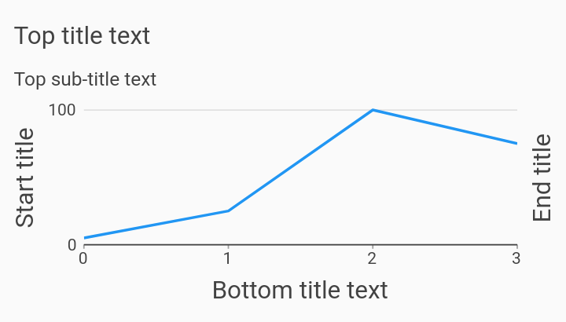

# Chart Title Behaviors Example



Example:

```
import 'dart:math';
// EXCLUDE_FROM_GALLERY_DOCS_END
import 'package:charts_flutter_clone/flutter.dart' as charts;
import 'package:flutter/material.dart';

/// This is a line chart with a title text in every margin.
///
/// A series of [ChartTitle] behaviors are used to render titles, one per
/// margin.
class ChartTitleLine extends StatelessWidget {
  final List<charts.Series> seriesList;
  final bool animate;

  ChartTitleLine(this.seriesList, {this.animate});

  /// Creates a [LineChart] with sample data and no transition.
  factory ChartTitleLine.withSampleData() {
    return new ChartTitleLine(
      _createSampleData(),
      // Disable animations for image tests.
      animate: false,
    );
  }


  @override
  Widget build(BuildContext context) {
    return new charts.LineChart(
      seriesList,
      animate: animate,
      // Configures four [ChartTitle] behaviors to render titles in each chart
      // margin. The top title has a sub-title, and is aligned to the left edge
      // of the chart. The other titles are aligned with the middle of the draw
      // area.
      behaviors: [
        new charts.ChartTitle('Top title text',
            subTitle: 'Top sub-title text',
            behaviorPosition: charts.BehaviorPosition.top,
            titleOutsideJustification: charts.OutsideJustification.start,
            // Set a larger inner padding than the default (10) to avoid
            // rendering the text too close to the top measure axis tick label.
            // The top tick label may extend upwards into the top margin region
            // if it is located at the top of the draw area.
            innerPadding: 18),
        new charts.ChartTitle('Bottom title text',
            behaviorPosition: charts.BehaviorPosition.bottom,
            titleOutsideJustification:
                charts.OutsideJustification.middleDrawArea),
        new charts.ChartTitle('Start title',
            behaviorPosition: charts.BehaviorPosition.start,
            titleOutsideJustification:
                charts.OutsideJustification.middleDrawArea),
        new charts.ChartTitle('End title',
            behaviorPosition: charts.BehaviorPosition.end,
            titleOutsideJustification:
                charts.OutsideJustification.middleDrawArea),
      ],
    );
  }

  /// Create one series with sample hard coded data.
  static List<charts.Series<LinearSales, int>> _createSampleData() {
    final data = [
      new LinearSales(0, 5),
      new LinearSales(1, 25),
      new LinearSales(2, 100),
      new LinearSales(3, 75),
    ];

    return [
      new charts.Series<LinearSales, int>(
        id: 'Sales',
        domainFn: (LinearSales sales, _) => sales.year,
        measureFn: (LinearSales sales, _) => sales.sales,
        data: data,
      )
    ];
  }
}

/// Sample linear data type.
class LinearSales {
  final int year;
  final int sales;

  LinearSales(this.year, this.sales);
}
```
