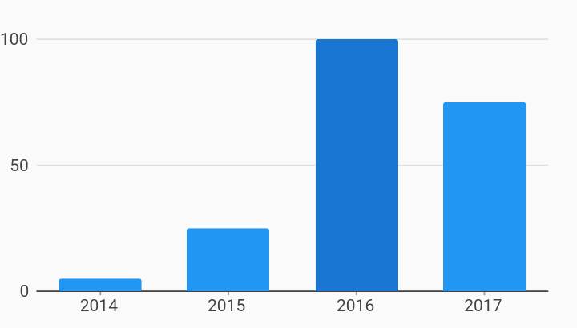

# Initial Selection Interactions Example



Example:

```
/// Example of adding an initial selection behavior.
///
/// This example adds initial selection to a bar chart, but any chart can use
/// the initial selection behavior.
///
/// Initial selection is only set on the very first draw and will not be set
/// again in subsequent draws unless the behavior is reconfigured.
///
/// The selection will remain on the chart unless another behavior is added
/// that updates the selection.

import 'package:charts_flutter_clone/flutter.dart' as charts;
import 'package:flutter/material.dart';

class InitialSelection extends StatelessWidget {
  final List<charts.Series> seriesList;
  final bool animate;

  InitialSelection(this.seriesList, {this.animate});

  /// Creates a [BarChart] with initial selection behavior.
  factory InitialSelection.withSampleData() {
    return new InitialSelection(
      _createSampleData(),
      // Disable animations for image tests.
      animate: false,
    );
  }


  @override
  Widget build(BuildContext context) {
    return new charts.BarChart(
      seriesList,
      animate: animate,
      behaviors: [
        // Initial selection can be configured by passing in:
        //
        // A list of datum config, specified with series ID and domain value.
        // A list of series config, which is a list of series ID(s).
        //
        // Initial selection can be applied to any chart type.
        //
        // [BarChart] by default includes behaviors [SelectNearest] and
        // [DomainHighlighter]. So this behavior shows the initial selection
        // highlighted and when another datum is tapped, the selection changes.
        new charts.InitialSelection(selectedDataConfig: [
          new charts.SeriesDatumConfig<String>('Sales', '2016')
        ])
      ],
    );
  }

  /// Create one series with sample hard coded data.
  static List<charts.Series<OrdinalSales, String>> _createSampleData() {
    final data = [
      new OrdinalSales('2014', 5),
      new OrdinalSales('2015', 25),
      new OrdinalSales('2016', 100),
      new OrdinalSales('2017', 75),
    ];

    return [
      new charts.Series<OrdinalSales, String>(
        id: 'Sales',
        colorFn: (_, __) => charts.MaterialPalette.blue.shadeDefault,
        domainFn: (OrdinalSales sales, _) => sales.year,
        measureFn: (OrdinalSales sales, _) => sales.sales,
        data: data,
      )
    ];
  }
}

/// Sample ordinal data type.
class OrdinalSales {
  final String year;
  final int sales;

  OrdinalSales(this.year, this.sales);
}
```
