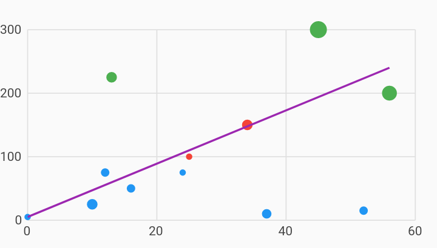

# Scatter Plot Line Combo Chart Example



Example:

```
/// Example of a combo scatter plot chart with a second series rendered as a
/// line.
import 'package:charts_flutter_clone/flutter.dart' as charts;
import 'package:flutter/material.dart';

class ScatterPlotComboLineChart extends StatelessWidget {
  final List<charts.Series> seriesList;
  final bool animate;

  ScatterPlotComboLineChart(this.seriesList, {this.animate});

  /// Creates a [ScatterPlotChart] with sample data and no transition.
  factory ScatterPlotComboLineChart.withSampleData() {
    return new ScatterPlotComboLineChart(
      _createSampleData(),
      // Disable animations for image tests.
      animate: false,
    );
  }


  @override
  Widget build(BuildContext context) {
    return new charts.ScatterPlotChart(seriesList,
        animate: animate,
        // Configure the default renderer as a point renderer. This will be used
        // for any series that does not define a rendererIdKey.
        //
        // This is the default configuration, but is shown here for
        // illustration.
        defaultRenderer: new charts.PointRendererConfig(),
        // Custom renderer configuration for the line series.
        customSeriesRenderers: [
          new charts.LineRendererConfig(
              // ID used to link series to this renderer.
              customRendererId: 'customLine',
              // Configure the regression line to be painted above the points.
              //
              // By default, series drawn by the point renderer are painted on
              // top of those drawn by a line renderer.
              layoutPaintOrder: charts.LayoutViewPaintOrder.point + 1)
        ]);
  }

  /// Create one series with sample hard coded data.
  static List<charts.Series<LinearSales, int>> _createSampleData() {
    final desktopSalesData = [
      new LinearSales(0, 5, 3.0),
      new LinearSales(10, 25, 5.0),
      new LinearSales(12, 75, 4.0),
      new LinearSales(13, 225, 5.0),
      new LinearSales(16, 50, 4.0),
      new LinearSales(24, 75, 3.0),
      new LinearSales(25, 100, 3.0),
      new LinearSales(34, 150, 5.0),
      new LinearSales(37, 10, 4.5),
      new LinearSales(45, 300, 8.0),
      new LinearSales(52, 15, 4.0),
      new LinearSales(56, 200, 7.0),
    ];

    var myRegressionData = [
      new LinearSales(0, 5, 3.5),
      new LinearSales(56, 240, 3.5),
    ];

    final maxMeasure = 300;

    return [
      new charts.Series<LinearSales, int>(
        id: 'Sales',
        // Providing a color function is optional.
        colorFn: (LinearSales sales, _) {
          // Bucket the measure column value into 3 distinct colors.
          final bucket = sales.sales / maxMeasure;

          if (bucket < 1 / 3) {
            return charts.MaterialPalette.blue.shadeDefault;
          } else if (bucket < 2 / 3) {
            return charts.MaterialPalette.red.shadeDefault;
          } else {
            return charts.MaterialPalette.green.shadeDefault;
          }
        },
        domainFn: (LinearSales sales, _) => sales.year,
        measureFn: (LinearSales sales, _) => sales.sales,
        // Providing a radius function is optional.
        radiusPxFn: (LinearSales sales, _) => sales.radius,
        data: desktopSalesData,
      ),
      new charts.Series<LinearSales, int>(
          id: 'Mobile',
          colorFn: (_, __) => charts.MaterialPalette.purple.shadeDefault,
          domainFn: (LinearSales sales, _) => sales.year,
          measureFn: (LinearSales sales, _) => sales.sales,
          data: myRegressionData)
        // Configure our custom line renderer for this series.
        ..setAttribute(charts.rendererIdKey, 'customLine'),
    ];
  }
}

/// Sample linear data type.
class LinearSales {
  final int year;
  final int sales;
  final double radius;

  LinearSales(this.year, this.sales, this.radius);
}
```
