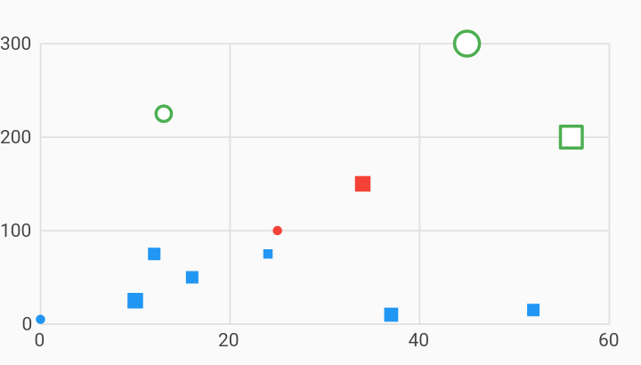

# Shapes Scatter Plot Chart Example



Example:

```
/// Example of a scatter plot chart using custom symbols for the points.
///
/// The series has been configured to draw each point as a square by default.
///
/// Some data will be drawn as a circle, indicated by defining a custom "circle"
/// value referenced by [pointSymbolRendererFnKey].
///
/// Some other data have will be drawn as a hollow circle. In addition to the
/// custom renderer key, these data also have stroke and fillColor values
/// defined. Configuring a separate fillColor will cause the center of the shape
/// to be filled in, with white in these examples. The border of the shape will
/// be color with the color of the data.
import 'package:charts_flutter_clone/flutter.dart' as charts;
import 'package:flutter/material.dart';

class ShapesScatterPlotChart extends StatelessWidget {
  final List<charts.Series> seriesList;
  final bool animate;

  ShapesScatterPlotChart(this.seriesList, {this.animate});

  /// Creates a [ScatterPlotChart] with sample data and no transition.
  factory ShapesScatterPlotChart.withSampleData() {
    return new ShapesScatterPlotChart(
      _createSampleData(),
      // Disable animations for image tests.
      animate: false,
    );
  }


  @override
  Widget build(BuildContext context) {
    return new charts.ScatterPlotChart(seriesList,
        animate: animate,
        // Configure the point renderer to have a map of custom symbol
        // renderers.
        defaultRenderer:
            new charts.PointRendererConfig<num>(customSymbolRenderers: {
          'circle': new charts.CircleSymbolRenderer(),
          'rect': new charts.RectSymbolRenderer(),
        }));
  }

  /// Create one series with sample hard coded data.
  static List<charts.Series<LinearSales, int>> _createSampleData() {
    final data = [
      new LinearSales(0, 5, 3.0, 'circle', null, null),
      new LinearSales(10, 25, 5.0, null, null, null),
      new LinearSales(12, 75, 4.0, null, null, null),
      // Render a hollow circle, filled in with white.
      new LinearSales(
          13, 225, 5.0, 'circle', charts.MaterialPalette.white, 2.0),
      new LinearSales(16, 50, 4.0, null, null, null),
      new LinearSales(24, 75, 3.0, null, null, null),
      new LinearSales(25, 100, 3.0, 'circle', null, null),
      new LinearSales(34, 150, 5.0, null, null, null),
      new LinearSales(37, 10, 4.5, null, null, null),
      // Render a hollow circle, filled in with white.
      new LinearSales(
          45, 300, 8.0, 'circle', charts.MaterialPalette.white, 2.0),
      new LinearSales(52, 15, 4.0, null, null, null),
      // Render a hollow square, filled in with white.
      new LinearSales(56, 200, 7.0, null, charts.MaterialPalette.white, 2.0),
    ];

    final maxMeasure = 300;

    return [
      new charts.Series<LinearSales, int>(
        id: 'Sales',
        // Providing a color function is optional.
        colorFn: (LinearSales sales, _) {
          // Bucket the measure column value into 3 distinct colors.
          final bucket = sales.sales / maxMeasure;

          if (bucket < 1 / 3) {
            return charts.MaterialPalette.blue.shadeDefault;
          } else if (bucket < 2 / 3) {
            return charts.MaterialPalette.red.shadeDefault;
          } else {
            return charts.MaterialPalette.green.shadeDefault;
          }
        },
        domainFn: (LinearSales sales, _) => sales.year,
        measureFn: (LinearSales sales, _) => sales.sales,
        radiusPxFn: (LinearSales sales, _) => sales.radius,
        fillColorFn: (LinearSales row, _) => row.fillColor,
        strokeWidthPxFn: (LinearSales row, _) => row.strokeWidth,
        data: data,
      )
        // Accessor function that associates each datum with a symbol renderer.
        ..setAttribute(
            charts.pointSymbolRendererFnKey, (int index) => data[index].shape)
        // Default symbol renderer ID for data that have no defined shape.
        ..setAttribute(charts.pointSymbolRendererIdKey, 'rect')
    ];
  }
}

/// Sample linear data type.
class LinearSales {
  final int year;
  final int sales;
  final double radius;
  final String shape;
  final charts.Color fillColor;
  final double strokeWidth;

  LinearSales(this.year, this.sales, this.radius, this.shape, this.fillColor,
      this.strokeWidth);
}
```
